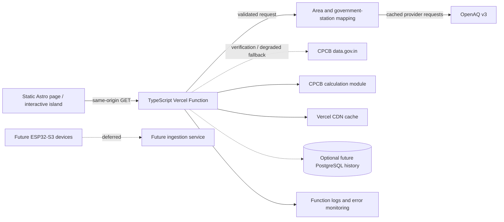

# AQI System Architecture

**Version:** 1.2  
**Date:** 26 September 2026  
**Status:** Approved for the Kolkata first release; TypeScript confirmed over FastAPI (26 Sep). A second view, `?view=history` (30 days, cached one hour), joins the route below  
**Related:** [Product and data plan](./01-product-and-data-plan.md)

## 1. Architecture decision

Keep the existing Astro site statically rendered and add the AQI server boundary as
a TypeScript Vercel Function in the same repository and Vercel project. This avoids
a separate FastAPI application, API hostname and deployment while keeping provider
keys outside the browser.

The first release reads current government-station data on demand, calculates CPCB
AQI in TypeScript and caches the public response at Vercel's CDN. It does not require
a database. Managed PostgreSQL becomes necessary only when OBOS elects to preserve
its own durable hourly history. Device ingestion, MQTT and fleet operations remain
future work.

This is server-side code, even though it ships with the Astro project. A purely
client-side implementation is not acceptable because it would expose provider keys,
multiply upstream traffic by visitor count and prevent consistent runtime validation.

## 2. Proposed repository layout

```text
/
├── api/
│   ├── live.js                    # Existing weather proxy
│   ├── climate-clock.js           # Existing Climate Clock proxy
│   └── air-quality.ts             # New government-station AQI function
├── src/
│   ├── lib/
│   │   └── aqi/
│   │       ├── types.ts           # Shared public response types
│   │       ├── schemas.ts         # Runtime validation of requests/upstreams
│   │       ├── openaq.ts          # Primary provider adapter
│   │       ├── data-gov.ts        # CPCB cross-check/fallback adapter
│   │       ├── cpcb-aqi.ts        # Versioned pure calculation module
│   │       └── station-mapping.ts # Government allowlist and area relationship
│   └── pages/                     # Existing Astro pages
├── tests/
│   ├── fixtures/aqi/
│   └── unit/aqi.test.mjs
└── docs/AQI/
```

The initial public route is deliberately small:

```text
GET /api/air-quality?area_id=in/kolkata/ballygunge
```

The existing project already deploys `api/live.js` and `api/climate-clock.js` as
same-origin Vercel Functions. AQI should reuse that pattern. Local `npm run dev`
must mount the new handler in the existing `devApiProxies()` Vite plugin, or
developers can use `vercel dev` when testing the complete deployment boundary.

Vercel documents TypeScript/JavaScript functions as request-driven server-side
compute. See [Vercel Functions](https://vercel.com/docs/functions).

## 3. Runtime flow



### Live station request

1. The Astro client requests an allowlisted OBOS `area_id`.
2. The function rejects unknown areas rather than accepting arbitrary coordinates.
3. It resolves the area's current government-station candidates and boundary version.
4. It reads a cached result or requests the required OpenAQ measurements.
5. Runtime schemas validate provider JSON before it reaches the calculation module.
6. The function averages OpenAQ's raw readings into IST clock hours (never OpenAQ's
   `/hours`, which omit data; register AQI-R23), then the CPCB module validates the
   observation window and calculates sub-indices.
7. The function returns a source-labelled result or a typed coverage failure.
8. Vercel caches the public response for a short, documented interval.

## 4. Components and responsibilities

### Astro interface

- request only the same-origin OBOS AQI function, never provider APIs;
- consume shared TypeScript response types;
- render measured, nearby, stale, insufficient and no-station states distinctly;
- display observation time, station, owner, source, standard and coverage status; and
- avoid recomputing authoritative AQI in the browser.

### TypeScript Vercel Function

- own provider credentials;
- allow only `GET` and validate `area_id` against the OBOS registry;
- call OpenAQ with explicit timeouts and bounded retries;
- restrict accepted locations to approved CPCB/WBPCB/KSPCB owners or providers;
- validate and normalize upstream values and units;
- invoke the versioned CPCB calculation module;
- attach response caching and security headers;
- return stable JSON success, coverage and error envelopes; and
- log request IDs and upstream status without logging credentials.

### Shared AQI modules

Provider access, station mapping and CPCB calculation belong in importable modules,
not inside the route handler. This keeps the handler small and makes the scientific
logic testable without network calls.

The calculation module must be a pure function over validated inputs. It returns
the AQI, pollutant sub-indices, dominant pollutant, quality flags and algorithm
version. Provider fixtures and official CPCB fixtures remain separate.

### Optional PostgreSQL history

No database is required to show a cached current reading. When OBOS needs durable
history, audits or scheduled archival, use managed PostgreSQL because Vercel Function
filesystems are not a persistent data store.

Later logical tables may include:

| Table | Responsibility |
|---|---|
| `areas` | OBOS area ID, city, boundary version and geometry reference |
| `instruments` | Regulatory station identity, owner, provider and coordinates |
| `instrument_assignments` | Versioned inside/nearby relationship to an area |
| `observations_raw` | Immutable upstream payload reference and ingestion metadata |
| `observations` | Normalized pollutant measurements |
| `aqi_snapshots` | Reproducible CPCB result and algorithm version |

Add PostGIS only when geometry is stored and queried in the database. Add a
time-series extension only after measured query volume demonstrates a need.

## 5. Type-safety boundary

The API function and Astro client share TypeScript types from `src/lib/aqi/types.ts`.
Compile-time types alone do not validate network input, so `schemas.ts` must parse:

- route query parameters;
- OpenAQ and data.gov.in responses; and
- the final public response before it is returned.

The runtime parser can use a small schema library or explicit type guards. The
choice should be made during implementation and covered by malformed-provider
fixtures. UI components call one typed wrapper rather than issuing ad hoc requests.

```text
provider JSON
      ↓
runtime schema parser
      ↓
normalized TypeScript domain objects
      ↓
versioned CPCB calculation
      ↓
shared AirQualityResponse union
      ↓
Astro UI
```

Use a discriminated union for result states such as `available`, `no_station`,
`insufficient_data`, `stale` and `source_unavailable`. This forces the UI to handle
absence and failure instead of assuming every response contains a number.

## 6. Vercel deployment and caching

The Astro site and AQI function deploy together from the existing Vercel project.
The browser uses a same-origin `/api` route, so a second hostname and CORS policy are
unnecessary for the first release.

Configuration requirements:

- store `OPENAQ_API_KEY` and `DATA_GOV_IN_API_KEY` as server-only Vercel variables;
- maintain separate preview and production credentials;
- set an explicit upstream timeout with `AbortController`;
- keep retries bounded so the function finishes predictably;
- choose a function region appropriate for the upstream and any future database;
- never include provider tokens in query strings, response bodies or logs; and
- keep the route read-only and cacheable.

Recommended successful response policy:

```http
Cache-Control: public, max-age=60, s-maxage=600, stale-while-revalidate=1800
```

The response must still expose `observed_at`, `computed_at`, `served_at` and a
freshness state. Cache age must never be presented as measurement time. Vercel
documents function response caching through
[Cache-Control headers](https://vercel.com/docs/caching/cache-control-headers).

Do not cache malformed requests, authentication/configuration failures or arbitrary
upstream error bodies. A carefully bounded last-known-good result may be served only
when it remains visibly labelled `stale`.

### Scheduling

The live pilot fetches on demand and relies on shared CDN caching. It therefore needs
no scheduled job. Add scheduled archival only when durable history becomes a product
requirement; at that point the job must write idempotently to managed storage.

## 7. Security design

### Provider credentials

- Keep credentials in Vercel environment variables without a `PUBLIC_` prefix.
- Send the OpenAQ key in its documented request header.
- Redact authorization headers and sensitive query parameters from logs.
- Rotate the WAQI token already shared through a URL, even though WAQI is excluded.
- Fail closed when required configuration is missing.

### Public route controls

- Allow only `GET`; return `405` with an `Allow` header for other methods.
- Resolve a finite area registry instead of proxying arbitrary coordinates or URLs.
- Apply request and upstream timeouts.
- Bound provider pages, measurement windows and response size.
- Return stable errors without raw exceptions or tokens.
- Run dependency and secret scanning in CI.

Same-origin access removes the need for permissive CORS. If a separate client is
added later, use an explicit origin allowlist.

## 8. Reliability and observability

Track at minimum:

- function request count, latency and status;
- upstream response status, timeout rate and latency;
- CDN cache effectiveness;
- age of the latest government-station observation;
- percentage of CPCB windows satisfying completeness requirements;
- distribution of coverage states by area; and
- algorithm version in served results.

An upstream failure must never become a clean-air reading. Return a visibly stale
last-known-good snapshot only within the documented policy; otherwise return
`source_unavailable`.

## 9. Growth path

Adopt managed PostgreSQL when OBOS needs durable hourly history, reproducible exports
or recalculation across stored raw observations. Introduce a dedicated ingestion
service only when scheduled workloads, device writes or operational isolation make
the single-project function unsuitable.

Future ESP32 devices can initially send signed HTTPS batches to a dedicated function
or service. MQTT, queues and long-running ML workloads remain separate future
decisions. They do not require changing the public AQI response contract.
