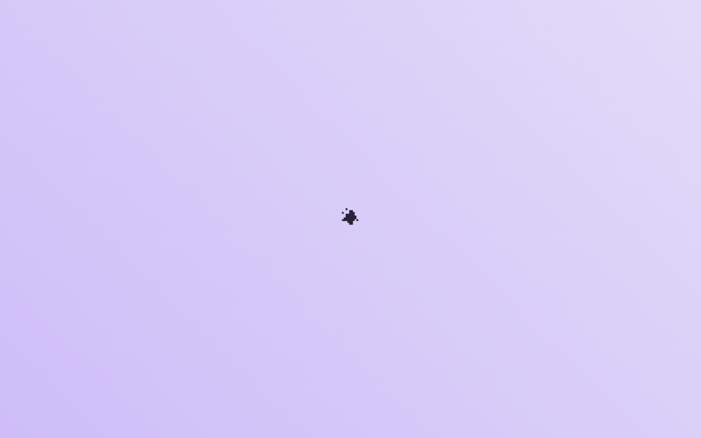
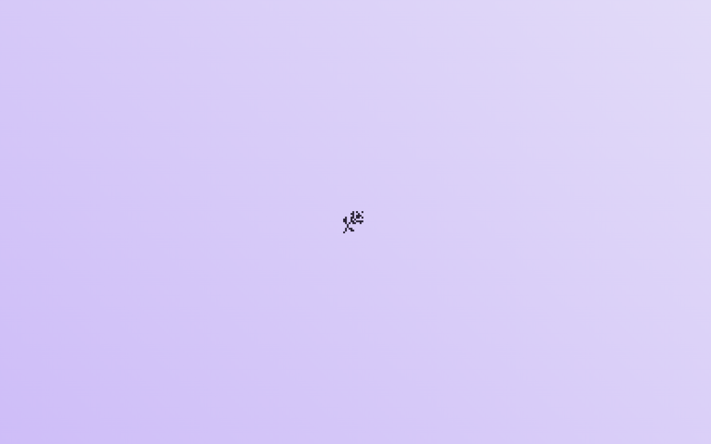
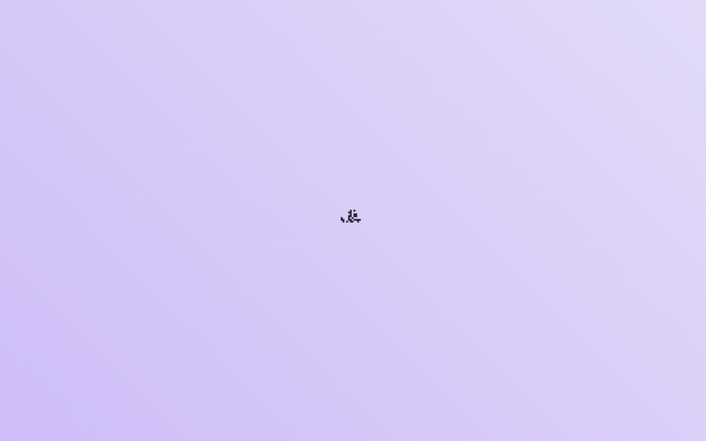

# DESIGN.md: Noomo — The Power of Digital Storytelling

## Source
- URL: https://storytelling.noomoagency.com/
- Capture date: 2026-06-08
- Evidence: Firecrawl scrape (`branding`+`images`, `rawHtml`, `markdown`) + local **WebGL render** (system Chrome + ANGLE/SwiftShader, 7 scroll frames) + main JS bundle analysis (`_nuxt/CbdjwYMp.js`, 1.6 MB).
- Artifacts: `.firecrawl/noomo-branding.json`, `.firecrawl/noomo.html`, `.firecrawl/noomo-bundle.js`, `.firecrawl/noomo-frames/00-hero.png … 06.png`
- ⚠️ Firecrawl's own renderer **failed to create a WebGL context** ("Error creating WebGL context"), so its screenshot is the error page. The real visuals were captured by a local WebGL render instead.

## Reference Frames

_Open these locally for the visual source of truth — they were captured via a headless WebGL render (SwiftShader), so motion/parallax is frozen and colors are approximate vs a GPU browser._

## Design Summary
An **award-tier, single-page immersive 3D "scrollytelling" manifesto** by Noomo Agency about the craft of digital storytelling itself. It's a **Nuxt 3 / Vue** SPA whose entire stage is a **Three.js WebGL scene** (custom GLSL `ShaderMaterial`s, `InstancedMesh` particle fields, a `PerspectiveCamera` on rails), choreographed by **GSAP ScrollTrigger** + **TWEEN**. There is **no traditional page**: you "**Click to start**", then scrolling advances a cinematic narrative where oversized type statements appear one-idea-per-beat over evolving 3D imagery, building to a three-part concept (**Light · Spirit · Sound**), four working **principles**, and a contact CTA. Tone: poetic, confident, studio-as-author. The takeaway for borrowing: **type as the protagonist, scroll as the narrator, one declarative thought per viewport.**

## Design Tokens

### Colors  _(branding confidence ~0.9)_
| Role | Value | Notes |
| --- | --- | --- |
| Background | `#FFFFFF` | `colorScheme: light` — the UI chrome/base is light |
| Text primary | `#000000` | near-pure black type |
| Primary | `#C4C5F1` | **periwinkle / lavender** — soft brand violet |
| Accent | `#D6D7F5` | **pale lilac** (also the link color) |
| Secondary | `#FB5959` | **coral red** — the single hot accent / highlight |
| Link | `#D6D7F5` | lilac |

Palette philosophy: **soft pastel violets as the brand bed + one coral red spark + black/white for type.** The 3D scene supplies additional light/color in motion (the "Light" pillar), so the fixed UI palette stays restrained. _(Note: the 3D scenes themselves often read darker/iridescent in motion — open the frames; the tokens describe the DOM chrome, not the live shader.)_

### Typography
- **One typeface for everything: `TTNeoris`** (TypeType foundry — a contemporary geometric-humanist sans with character). Used for both display and body; `fontStacks` fall back to `ui-sans-serif, system-ui, sans-serif`.
- **Brutal scale contrast:** colossal hero/display ("The power of digital / storytelling" set as a stacked 2-line wordmark) vs. ~`18px` body. _(The `branding` JSON's `h1:10px` is bogus — measured off the WebGL error page, ignore it.)_
- Headings stack across lines as a typographic object; body copy is short, declarative, one statement per scroll beat.
- Fallback rec for our stack: TTNeoris is paid; a free analog with similar geometric-humanist warmth would be **Mona Sans** (which Delta already uses) or **Bricolage Grotesque**.

### Spacing And Layout
- Base unit **4px**; **border-radius 20px** (soft, rounded — pills/rounded panels for the light UI chrome).
- Full-bleed, viewport-locked stage (`viewport-fit=cover`, `maximum-scale=1`) — it's an app, not a scroll document; "scroll" drives the timeline, not the page height in the usual sense.
- Edge-pinned minimal chrome: logo top-left, nav top-right, "Scroll to explore" / "Click to start" affordances.

## Components
- **Intro gate** — a "**Click to start**" entry (loads/inits the WebGL scene before the experience begins). Common award-site pattern: gate the heavy 3D behind one intentional click.
- **Hero wordmark** — "The power of digital / storytelling" stacked display type over the live scene.
- **Manifesto beats** — full-viewport statements revealed one at a time on scroll: _"The best stories don't just speak to us. They invite us inside."_, _"Storytelling is much more than words. It is how a spark becomes a fire."_, _"Storytelling is what you see, feel, hear, interact with."_
- **Three-pillar concept** — **Light · Spirit · Sound**, framed by the question _"How can the story live at the heart of the experience?"_ (a triad of one-word concepts, each likely its own 3D scene/section).
- **Numbered principles** — four working tenets, each a short title + one-line elaboration:
  1. **Start with clarity** — "Know what you're trying to say… the goal needs to be clear."
  2. **Let the story guide design** — "Every animation, interaction, and visual should serve the narrative. If it doesn't help tell the story, it's not needed."
  3. **Experiment and iterate** — "Some of the best ideas came from simply trying things out…"
  4. **Make it personal** — "The best stories create emotional connections… make the experience unique for each user."
- **CTA / outro** — _"Where stories become experiences"_, a featured case ("**Reimagine Phoenix**"), "**Scroll to explore**", and a contact line `hello@noomoagency.com` + socials (x, Instagram, LinkedIn).
- **Nav** — minimal: Home / Agency / Labs / Contact; hamburger "Menu" with social row; a separate WebGL-error fallback screen ("Don't feel lost, let's go Home").

## Page Patterns
- **Single-page scroll-timeline** (not multi-route): one continuous scroll choreographs camera + scenes. Section order: **Click-to-start gate → hero wordmark → manifesto beats → Light/Spirit/Sound triad → 4 principles → case CTA → footer/contact.**
- **One idea per viewport.** Each beat earns a full screen; nothing is crowded.
- Graceful **WebGL fallback** screen for unsupported contexts.

## Motion And Interaction  _(the part worth borrowing)_
- **Three.js stage** — custom `ShaderMaterial` (×18 in bundle) for lighting/iridescence, `InstancedMesh` (×16) for particle/element fields, a `PerspectiveCamera` (×7) moved along the narrative.
- **GSAP ScrollTrigger** (×29) + **TWEEN** (×75) — scroll position is the timeline scrubber; type and camera and shader uniforms animate against it. This is the same family as Delta's existing Lenis + GSAP ScrollTrigger setup, so the *technique* is reproducible; the 3D scene is the heavy part.
- **Scroll-pinned reveals**: statements fade/clip in, hold, then hand off to the next beat as the camera moves.
- **Intro gate** click → scene init; "Scroll to explore" cue.

## Content Style
- **Poetic, declarative, second-person.** Short lines, each a self-contained thought. ("It is how a spark becomes a fire.")
- **Studio-as-author voice** — confident manifesto about their own craft, not a feature list.
- **Concept triads + numbered principles** as the structural backbone — abstract idea (Light/Spirit/Sound) paired with concrete method (the 4 principles).
- Real client proof woven into the close (Salesforce, AMD, Coinbase, Intel, Vogue per metadata; "Reimagine Phoenix" as the featured case).

## Tech Stack (observed)
- **Nuxt 3 / Vue** (`_nuxt/` bundle, `__nuxt` ×11) — SPA.
- **Three.js** (`THREE.` ×206, `WebGLRenderer` ×34, `BufferGeometry` ×20, `ShaderMaterial` ×18, `InstancedMesh` ×16, `PerspectiveCamera` ×7) — the WebGL engine.
- **GSAP + ScrollTrigger** (×65 / ×29) and **TWEEN** (×75) — animation.
- **TTNeoris** webfont; Google Tag Manager for analytics.
- `designSystem.framework: "custom"`, no component library.

## What To Borrow For Delta's About Redesign  _(why this was captured)_
Delta's current About is a single static grid (index + "Between the data and the *Decision.*" + a paragraph + 3 pillars + a figure panel). Noomo points at a more **editorial, scroll-revealed** treatment that's achievable **without** a full Three.js rebuild, reusing Delta's Lenis + GSAP system:
1. **One-idea-per-beat manifesto** — break the About paragraph into 2–4 oversized declarative statements that reveal on scroll (pin + fade/clip), instead of one block. Delta already has `data-reveal`/`data-clip`.
2. **Concept triad → method pairing** — Noomo's "Light/Spirit/Sound + 4 principles" maps cleanly onto Delta's existing three pillars (**Climate science / Urban heat / Industrial strategy**); consider adding a short numbered "how we work" set beneath them.
3. **Numbered principles pattern** — `01 title + one line` stacked list (echoes Delta's existing `sec-index` numbering and the serif-accent voice).
4. **Restrained palette + one hot accent** — Noomo: pastel violets + a single coral spark. Delta's analog is already there (teal/cyan + bronze on near-black); keep the discipline of *one* warm spark.
5. **Type as protagonist** — let Mona Sans display + the Moonscape serif-italic accent carry the section, minimal chrome.

**Don't borrow:** the full WebGL/Three.js stage (overkill + perf cost for an About section; Delta's tamed vortex already supplies the 3D "presence"), the "Click to start" gate (wrong for a content site that needs SEO/immediacy), the light/pastel scheme (off-brand for Delta's dark editorial), or the heavy intro load.

## Agent Build Instructions
To build a section "in this style" **within Delta's constraints**: keep the near-black editorial base; set 2–4 **oversized single-thought statements** that reveal one per scroll beat (GSAP ScrollTrigger pin + clip/fade on Delta's Lenis loop, transforms/opacity only); structure the substance as a **concept triad + numbered principles**; use **one typeface** (Mona Sans) with the **Moonscape serif-italic** accent for the emotive word and **Noplato Mono** for the `01/02/03` indices; restrict color to the existing teal/cyan with a single warm accent; no WebGL gate, no pastel. Let scroll narrate; let type lead.

## Rerun Inputs
workflow: firecrawl-website-design-clone
source_url: https://storytelling.noomoagency.com/
target_stack: Astro + Tailwind v4 (Delta Climate Research)
output: inspiration/noomo-storytelling/DESIGN.md

> Note: third-party logos, imagery, fonts (TTNeoris), copy, and client names belong to Noomo Agency and its clients — this is a design *analysis* for inspiration, not an asset or content license.
