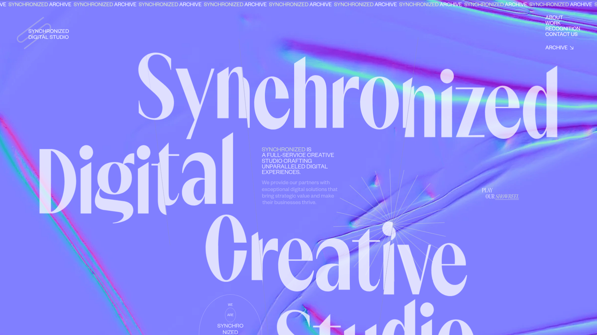

# DESIGN.md: synchronized.studio

## Source
- URL: https://synchronized.studio/
- Capture date: 2026-06-06
- Evidence: Firecrawl scrape — `branding` + `images` tokens, full-page screenshot, raw HTML + markdown + links
- Artifacts: `.firecrawl/sync-branding.json`, `.firecrawl/sync-content.json`, `inspiration/synchronized-studio/hero.png`

## Reference Screenshot

_Visual source of truth for layout/feel. The captured frame: a colossal cream serif wordmark
("Synchronized Digital Creative Studio") stacked over a live iridescent WebGL gradient (purple →
blue → pink → teal), a looping "synchronized archive" marquee strip at the very top, body copy
mid-left, and small mono labels pinned to the edges._

## Design Summary
An award-tier **creative-studio** site: maximal **editorial type** over a **living iridescent
shader**, restrained to a near-monochrome UI so the giant serif + the gradient do all the talking.
It's a **Nuxt/Vue single-page app** that swaps "sections" via query params (`?section=work` etc.)
rather than full navigations, with **GSAP** scroll-reveals, a **WebGL `<canvas>`** background, and
**smooth scrolling** (`data-scroll`). Sharp corners (radius 0), huge type-scale contrast, playful
hand-drawn SVG accents (hand, star, rotating circular text), and numbered case studies. Tone:
modern, confident, "we are the studio behind the work."

## Design Tokens

### Colors  _(branding confidence ~0.9)_
| Role | Value | Notes |
| --- | --- | --- |
| Background (base) | `#151515` | near-black; the dark canvas the shader sits over |
| Display / primary | `#DEEBC8` | **pale pistachio cream** — the big serif headlines |
| Text on light | `#151515` | dark text where panels invert |
| Accent / muted | `#6C757D` | gray — small labels, links |
| (`secondary` `#007BFF`) | inferred/default | low confidence — likely a UA link default, not a brand color |
| Hero gradient | iridescent | live WebGL: violet `~#8E86F5` → blue → magenta → teal, soft holographic flow (not a fixed token) |

Palette philosophy: **one warm-neutral display color + near-black + a single iridescent moment.**
The color comes from the *shader*, not the UI chrome.

### Typography  _(font names masked as Font-A/B/C — licensed webfonts)_
- **Display / headings** ("Font-C"): a **high-contrast serif** (thin hairlines, dramatic thick/thin),
  used at enormous sizes. Captured `h2 ≈ 91px`; hero wordmark is far larger (fluid, viewport-scaled).
  Fallback rec: a contrast serif — *Canela, GT Sectra, PP Editorial New, Boska*; in our stack
  **Spectral** is the closest free analog.
- **Body / labels** ("Font-A"): a clean grotesque/sans at `~19px`, plus tiny **all-caps mono-ish
  labels** for eyebrows ("WE ARE", "SINCE '18", "ARCHIVE").
- **Scale**: brutal contrast — ~12–14px labels vs. ~90px→200px+ display. Mid-tier body sits ~19px.
- **Emphasis pattern**: *serif italics* dropped inline into otherwise-roman service lists
  ("Creative **Front-end** *Development*", "Art *Direction*") — same trick Delta already uses.

### Spacing And Layout
- Base unit **4px**; generous full-bleed sections.
- **Border-radius: 0** everywhere — hard, editorial, print-like.
- Big vertical rhythm; type often bleeds to/over the viewport edges.
- Edge-pinned micro-labels (top-left marquee, corner captions) — a "framed canvas" feel.

## Components
- **Marquee strip** — infinite horizontal loop of "**synchronized** archive" repeated, very top of page.
- **Hero type stack** — the studio name set as 3–4 stacked display lines, each near-full-width.
- **Eyebrow label cluster** — tiny stacked caps ("we / are / SYNCHRO / NIZED / studio / all together
  / since '18") used as a typographic texture block.
- **Showreel play** — "Play our *showreel*" with an italic link + a small play affordance.
- **Service list** — "Just About": run-on list of services with serif-italic emphasis words.
- **Rotating circular text** SVG (`circle-text.svg`) + hand-drawn accents (`hand.svg`, `sun.svg`,
  `shape.svg`, `face.svg`) — playful, sticker-like, counter to the serious type.
- **Numbered case cards** — "Selected cases": big image + index (`1`, `2`, `3`…), project title
  (e.g. *Google Ventures*, *Canary Islands × Expedia*, *Tezza*), one-line description, **Explore →**
  external link. Imagery served from Contentful (`cmsassets.com`, `?fm=webp&q=80`).
- **Recognition** section (awards) + **Contact** with socials (Instagram, Facebook, `mailto:`).

## Page Patterns
- **SPA section model**: `?section=home|about|work|recognition|contact-us` — content swaps in place,
  no hard nav (Nuxt/Vue router + transitions).
- **Order**: marquee → hero (name + shader + intro copy) → "we are" eyebrow block → showreel →
  services → selected cases (numbered) → recognition → contact/footer.
- **Responsive**: fluid type (viewport units), single-column stacking on mobile; the shader scales full-bleed.

## Motion And Interaction  _(the part worth borrowing)_
- **WebGL iridescent gradient** — the hero background is a live `<canvas>` shader (flowing
  holographic mesh). This is the signature move. _(Achievable with a fragment shader; in our stack
  the `@paper-design/shaders` "warp"/"mesh-gradient" we just added to the footer is the same family.)_
- **GSAP** scroll-triggered reveals (type rises/clips in on scroll).
- **Smooth scroll** via `data-scroll` (Locomotive/Lenis-style) — momentum + scroll-linked motion.
- **Looping marquee** (CSS/JS infinite translate).
- **Rotating circular SVG text** (continuous slow spin).
- **Hover**: link underlines/italic swaps; case images likely scale/parallax on hover.

## Content Style
- **Big declarative statements** as design ("Synchronized is a full-service creative studio crafting
  unparalleled digital experiences").
- **Serif-italic emphasis** sprinkled into roman text for rhythm.
- **Numbered, named case studies** with a single confident sentence + an *Explore* outbound link.
- Playful eyebrow fragments ("since '18", "all together") humanize the maximalism.

## Background — EXACT technique (reverse-engineered from the `_nuxt` bundles)
Two layered techniques, **no bespoke GLSL shader to copy**:
- **WebGL effects = PixiJS + pixi-filters** (MIT, open source). The app instantiates
  **`DisplacementFilter` ×42** (the dominant one) + **`TwistFilter`**, applied to **`Sprite`s** (×135)
  of dark `Bitmap` textures, driven by a **`displacementSprite`** (×67) — a noise/cloud texture whose
  R/G channels push the source pixels around → the flowing "liquid/silk" warp. Animated via GSAP.
  _(Earlier note said OGL — that was wrong; "ogl" was matching "g**oogl**e". It's PixiJS: `pixi.js`
  ×87 in the vendor bundle, all the `void main` shaders are pixi-filters: RGBSplit/Twist/Godray/…)_
- **SVG filters** also used for some warps: `feTurbulence` (fractalNoise, anisotropic baseFrequency
  like `0.01 0.7`) → `feDisplacementMap` (scale 30–90), GSAP-animating `baseFrequency` with a
  **RoughEase**. The lighter, CSS-native cousin of Pixi's DisplacementFilter.

**The key ingredient both share:** a **rich dark SOURCE texture** (the `Bitmap.*` images — dark
marble/ink/cloud) that gets warped. Warping a flat gradient (my preview attempts) looks too smooth;
the organic silk comes from displacing a textured image.

**Recipe:** a dark element/texture with an SVG `<filter>` applied, where:
- `<feTurbulence type="fractalNoise" baseFrequency="…" numOctaves="3–20" result="warp">` generates
  fractal (Perlin) noise. **Anisotropic baseFrequency** like `0.01 0.7`, `0.15 0.02`, `0.01 0.07`
  (different x vs y) is what stretches the noise into **directional silk/fabric streaks**.
- `<feDisplacementMap xChannelSelector="R" yChannelSelector="G" scale="30–90" in="SourceGraphic"
  in2="warp">` uses that noise to **warp the source pixels** → the liquid/silk distortion. `scale`
  controls warp intensity (they use 30/40/35/90 across filter-2…n).
- **Animation = GSAP**: a timeline mutates the live filter every frame —
  `feTurbulence.setAttribute('baseFrequency', value)` on `onUpdate` — eased with GSAP **`RoughEase`**
  (`rough({ strength: 2, points: 120, randomize: true })`) for organic jitter, reversing on
  scroll/hover with `Power4.easeInOut`.

**Why this matters for Delta:** it's **lightweight SVG/CSS + GSAP — no WebGL, no React island.** We
*already* use `feTurbulence` (the `.grain`) and we *already* have GSAP. So the OG dark-silk look is
reproducible with a single animated `<filter>` over a dark surface — far leaner and more on-brand
than the `@paper-design` shaders I previewed (which is why those felt wrong).

## Tech Stack (observed)
- **Nuxt 3 / Vue** (`_nuxt/` asset paths, SPA section routing).
- **GSAP** (animation), **WebGL `<canvas>`** (hero shader), **`data-scroll`** smooth-scroll lib.
- **Contentful** CMS for case imagery (`images.ctfassets.net`, `synchronized.cmsassets.com`).
- Custom design system (`designSystem.framework: "custom"`, no component library).

## What To Borrow For Delta Climate Research  _(why this was captured)_
Delta already shares the DNA (dark base, serif-italic accents via Spectral, GSAP + Lenis smooth
scroll, mono micro-labels). High-value, on-brand steals — **without** going full neon-studio:
1. **Iridescent shader as a hero moment** — we already added `@paper-design/shaders` for the footer;
   a tuned, *cool teal* warp/mesh-gradient could elevate the Hero or Medni section (kept restrained).
2. **Colossal stacked display type** — a bigger, edge-bleeding `.sec-title`/hero treatment for one
   signature section (Delta's type is currently conservative).
3. **Numbered case studies** — apply the "01 / Title / one line / Explore →" pattern to the Projects
   rail for a more editorial, confident case index.
4. **Looping marquee** — a slow mono marquee (e.g. the service keywords or coordinates) as a texture band.
5. **Rotating circular SVG text** — a small "DELTA · CLIMATE · RESEARCH ·" seal as a quiet accent.
6. **Serif-italic emphasis in service lists** — extend the existing `.em-accent` usage into the About pillars.

**Don't borrow:** the maximal saturation/neon, sharp 0-radius everywhere (Delta's 14px cards are
part of its calm), or the SPA-section model (our multipage + view-transitions is better for SEO).

## Agent Build Instructions
To build a page "in this style": near-black base; **one** warm-neutral display color; a **single**
live iridescent shader behind an oversized **contrast-serif** wordmark stacked 3–4 lines; tiny
all-caps mono labels pinned to the edges; **radius 0**; GSAP scroll-reveals + momentum smooth-scroll;
a top marquee; numbered case cards (image / index / title / one-line / Explore →); serif-italic
emphasis inside roman service lists; playful hand-drawn SVG accents as counterpoint. Keep the UI
chrome monochrome so the type and the gradient carry the whole experience.

## Rerun Inputs
workflow: firecrawl-website-design-clone
source_url: https://synchronized.studio/
target_stack: Astro + Tailwind v4 (Delta Climate Research)
output: inspiration/synchronized-studio/DESIGN.md

> Note: third-party logos, imagery, fonts, and copy belong to Synchronized — this is a design
> *analysis* for inspiration, not an asset license.
